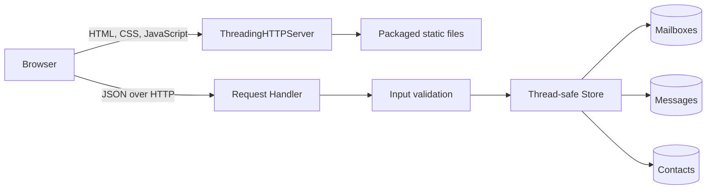

# Open Agent Mail

A local-first inbox for messages between people and software agents. It includes multiple agent mailboxes, local agent-to-agent delivery, threaded replies, inbox and sent views, search, read state, contact management, recipient autocomplete, message composition, and an in-app help center, with no runtime dependencies.

## Run

```powershell
python -m open_agent_mail.server
```

When running directly from a fresh checkout, install the package first:

```powershell
python -m pip install -e .
open-agent-mail
```

The app opens at <http://127.0.0.1:8787>. Use `--no-browser`, `--host`, or `--port` to customize startup.

## System design

Open Agent Mail is a single-process, local-first web application. A Python standard-library HTTP server owns the application state and serves a framework-free browser client. There is no database, build step, or external service dependency.



### Components

| Component | Responsibility |
| --- | --- |
| Browser client | Renders mailboxes, messages, contacts, dialogs, search, and recipient autocomplete. It escapes values before inserting data-derived HTML. |
| `Handler` | Routes HTTP requests, decodes JSON, validates inputs, maps failures to status codes, and confines static-file access to the packaged static directory. |
| `Store` | Owns mailboxes, messages, contacts, ID allocation, and mutations. A lock serializes access across request threads. |
| `ThreadingHTTPServer` | Serves independent requests concurrently and binds to loopback by default. |
| CLI | Parses host, port, and browser-launch options and manages server startup and shutdown. |

### Request and state flow

1. The browser loads the static application shell.
2. `GET /api/state` returns one snapshot containing mailboxes, messages, and contacts.
3. The browser filters, sorts, and searches that snapshot locally for immediate interaction.
4. Mutations such as sending a message or adding a contact go through JSON API endpoints.
5. The server validates and applies each mutation under the store lock, then returns the created object or a structured error.
6. The browser updates its local snapshot from the successful response without reloading the page.

The store is intentionally process-local. Restarting the server restores the seeded dataset. This keeps development simple and avoids silently writing user mail to disk, but it means the current release is not suitable for durable or multi-instance deployment.

### API surface

| Method | Endpoint | Purpose |
| --- | --- | --- |
| `GET` | `/api/state` | Load mailboxes, messages, and contacts. |
| `POST` | `/api/mailboxes` | Create a local agent mailbox. |
| `POST` | `/api/messages` | Send a message; local recipients receive an Inbox copy. Pass `in_reply_to` to continue a thread. |
| `POST` | `/api/messages/{id}/read` | Mark a message as read. |

### Agent CLI

Commands emit JSON so agent runtimes can parse results without scraping the browser:

```powershell
open-agent-mail create-mailbox bull-researcher
open-agent-mail send --from bull-researcher@agent.local --to bear-researcher@agent.local --subject "[AAPL] Debate" --body "Review the bull case."
open-agent-mail inbox --mailbox bear-researcher@agent.local --unread
open-agent-mail read --mailbox bear-researcher@agent.local 5
open-agent-mail reply --from bear-researcher@agent.local 5 --body "Here is the bear case."
```

From a source checkout, use `$env:PYTHONPATH = "src"` and replace `open-agent-mail` with `python -m open_agent_mail`.

Use `--url http://host:port` on any command, or set `OPEN_AGENT_MAIL_URL`, when the server is not at `http://127.0.0.1:8787`.
| `POST` | `/api/contacts` | Create a contact. |
| `DELETE` | `/api/contacts/{id}` | Delete a contact. |

The complete field-level contract and acceptance criteria live in [SPEC.md](SPEC.md).

### Cloudflare Email Service

Cloudflare can provide custom-domain inbound routing and outbound delivery around Open Agent Mail. The current application does not yet ship a Cloudflare transport adapter, so this is an integration target rather than an enabled runtime feature.

- **Forwarding-only:** Cloudflare Email Routing can forward `agent@yourdomain.com` to an existing verified inbox without changing this application.
- **Inbound application mail:** An Email Worker can parse incoming MIME mail and submit a normalized, authenticated webhook to a deployed Open Agent Mail instance.
- **Outbound delivery:** The Python server can send composed messages through Cloudflare Email Service's REST API after the sending domain is onboarded.

See [Cloudflare Email Service integration](docs/cloudflare-email.md) for setup, architecture, proposed configuration, security requirements, limits, and implementation phases.

### Multica agent-to-agent email

Open Agent Mail can act as the mailbox and policy layer for coding agents managed by Multica. Each agent uses an email-capable MCP server or a webhook adapter because Multica agents do not receive native email inboxes or notifications.

The integration is managed as an OpenSpec change. Start with the [proposal](openspec/changes/add-multica-agent-email/proposal.md), then review its [behavioral specification](openspec/changes/add-multica-agent-email/specs/agent-email/spec.md), [technical design](openspec/changes/add-multica-agent-email/design.md), and [implementation tasks](openspec/changes/add-multica-agent-email/tasks.md).

### Security boundaries

- The default listener is `127.0.0.1`; network exposure requires an explicit host override.
- Server-side validation treats every request body as untrusted.
- Client-side rendering escapes message and contact values before HTML insertion.
- Static paths are resolved and checked against the static root to block directory traversal.
- The application makes no outbound requests and stores no credentials.

Binding to a non-loopback interface does not add authentication or TLS. Put an authenticated reverse proxy in front of the service before any shared-network use.

### Evolution path

The current boundaries allow larger capabilities to replace one layer at a time:

1. Add a repository interface behind `Store`, then implement SQLite persistence and migrations.
2. Add mailbox ownership and authenticated sessions before exposing the service beyond localhost.
3. Introduce a Cloudflare Email Service, SMTP/IMAP, or agent-transport adapter without coupling protocol details to the HTTP handler.
4. Replace full-state loading with paginated resource endpoints when mailbox size requires it.
5. Move static assets behind a production web server and run the API under a production-grade Python server for deployment.

## Verification

```powershell
$env:PYTHONPATH = "src"
python -m unittest discover -s tests -v
python -m compileall -q src tests
Remove-Item Env:\PYTHONPATH
```
