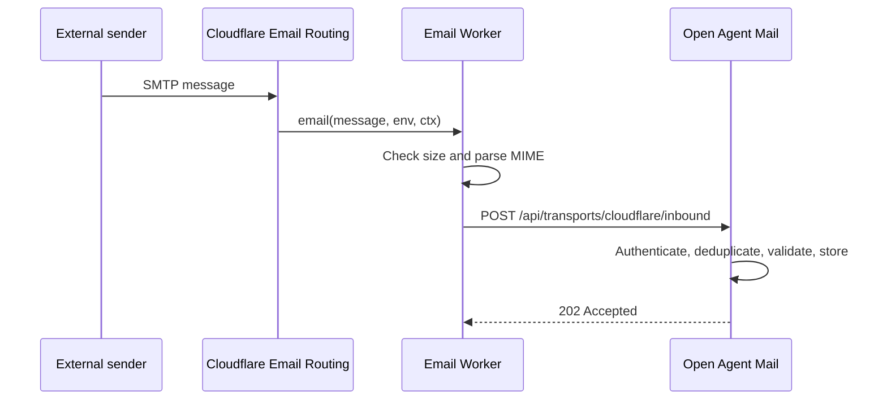

# Cloudflare Email Service integration

Status: design documentation; not implemented in the current release.

This guide describes how Open Agent Mail can use Cloudflare Email Service for custom-domain routing, inbound processing, and outbound delivery while keeping provider-specific behavior outside the core mailbox store.

## Capability map

| Requirement | Cloudflare capability | Open Agent Mail integration |
| --- | --- | --- |
| Receive at `agent@example.com` | Email Routing rule | Forward to a verified address, or route to an Email Worker. |
| Parse inbound messages | Email Worker's `email()` handler and raw MIME stream | Worker parses MIME and calls an authenticated ingestion endpoint. |
| Send composed messages | Email Service REST API, Workers binding, or SMTP | Prefer the REST API from the Python transport adapter. |
| Reply at the edge | Email Worker's `message.reply()` | Optional for automated replies; not the primary web-app compose path. |
| Manage aliases | Email Routing dashboard or REST API | Keep route provisioning outside the initial app process. |

Cloudflare Email Service requires the domain to use Cloudflare DNS. Routing and sending are onboarded separately and use separate DNS authentication records.

## Deployment shapes

### 1. Forwarding only

Use this when a custom agent address only needs to deliver into an existing mailbox:

```text
sender -> Cloudflare Email Routing -> verified destination inbox
```

No Open Agent Mail code or public endpoint is involved. In the Cloudflare dashboard:

1. Open **Compute > Email Service > Email Routing**.
2. Onboard the domain and allow Cloudflare to add the routing MX, SPF, and DKIM records.
3. Add and verify a destination address.
4. Create a routing rule for the desired local part, such as `agent@example.com`.
5. Send a test from an address other than the forwarding destination.

### 2. Full inbound ingestion

Use an Email Worker as the internet-facing adapter:



The Worker should use a MIME parser such as `postal-mime`, extract a bounded plain-text representation, and send only the fields the application accepts. Do not expose the current local server directly: the existing API has no authentication or TLS.

Proposed webhook payload:

```json
{
  "provider": "cloudflare",
  "provider_message_id": "<message-id@example.net>",
  "envelope_from": "sender@example.net",
  "envelope_to": "agent@example.com",
  "subject": "Build status",
  "text": "The build completed.",
  "received_at": "2026-08-19T12:00:00Z"
}
```

The future ingestion endpoint should:

- Require an HMAC signature over the raw request body plus a timestamp.
- Reject timestamps outside a short replay window.
- Deduplicate on `provider` and `provider_message_id`.
- Limit request and decoded message sizes before parsing or storage.
- Map the envelope recipient to an explicitly configured mailbox.
- Ignore or sanitize HTML initially; never render inbound HTML unsandboxed.
- Return `202` only after durable storage is available.

Example Worker outline:

```js
import PostalMime from "postal-mime";

export default {
  async email(message, env) {
    if (message.rawSize > 5 * 1024 * 1024) {
      message.setReject("Message too large");
      return;
    }

    const parsed = await PostalMime.parse(message.raw);
    const payload = JSON.stringify({
      provider: "cloudflare",
      provider_message_id: message.headers.get("message-id"),
      envelope_from: message.from,
      envelope_to: message.to,
      subject: parsed.subject || "(no subject)",
      text: parsed.text || "",
      received_at: new Date().toISOString(),
    });

    // Add a timestamp and HMAC signature using env.OPEN_AGENT_MAIL_WEBHOOK_SECRET.
    const response = await fetch(env.OPEN_AGENT_MAIL_WEBHOOK_URL, {
      method: "POST",
      headers: { "content-type": "application/json" },
      body: payload,
    });
    if (!response.ok) throw new Error(`Ingestion failed: ${response.status}`);
  },
};
```

The signature code is intentionally omitted from this outline; deploy only after implementing and testing the complete signing protocol on both sides.

### 3. Outbound delivery

For this Python application, prefer Cloudflare's REST API over a Worker binding:

```text
browser -> Open Agent Mail API -> Cloudflare Email Service REST API -> recipient
```

The adapter would call:

```text
POST https://api.cloudflare.com/client/v4/accounts/{account_id}/email/sending/send
Authorization: Bearer {api_token}
Content-Type: application/json
```

with a structured body containing `from`, `to`, `subject`, and `text`. Keep the API token server-side and request only the permission needed to send email. Never place it in browser JavaScript, repository files, logs, or API responses.

Proposed server configuration:

| Variable | Purpose |
| --- | --- |
| `OPEN_AGENT_MAIL_TRANSPORT=cloudflare` | Select the Cloudflare outbound adapter. |
| `CLOUDFLARE_ACCOUNT_ID` | Account containing Email Service. |
| `CLOUDFLARE_EMAIL_API_TOKEN` | Secret token with email-send permission. |
| `OPEN_AGENT_MAIL_FROM_DOMAIN` | Onboarded sender domain. |
| `OPEN_AGENT_MAIL_WEBHOOK_SECRET` | Shared secret used only for inbound webhook signatures. |

Configuration names are proposed and may change when the adapter is implemented.

## Domain and DNS setup

1. Move or delegate authoritative DNS for the domain to Cloudflare.
2. Onboard **Email Routing** for inbound delivery. Review the MX, SPF, and DKIM records Cloudflare proposes.
3. Onboard **Email Sending** separately for outbound delivery. It uses records under the `cf-bounce` subdomain, including SPF and DKIM records.
4. Configure DMARC for the organizational domain and begin with a monitoring policy appropriate to the domain's current mail setup.
5. Verify every forwarding destination before referencing it in a routing rule.
6. Create a staging alias and validate inbound and outbound paths before enabling a catch-all rule.

Do not hand-edit generated record values from examples; use the exact values shown for the domain in the Cloudflare dashboard.

## Limits and operational behavior

Design against Cloudflare's published limits rather than assuming unrestricted mail:

- Inbound messages are limited to 25 MiB.
- Standard outbound messages are limited to 5 MiB; messages to verified destination addresses may be up to 25 MiB.
- `to`, `cc`, and `bcc` allow 50 combined recipients per message.
- A domain supports up to 200 routing rules, and an account supports up to 200 verified destination addresses.
- New accounts begin with conservative outbound quotas that can change with account standing and sending behavior.
- Email Workers consume normal Workers CPU and memory limits.
- Sends through a Worker binding can appear as dropped in the Email Routing summary; use Email Sending metrics and logs for outbound delivery status.

Apply lower application limits where possible, retry only transient failures with exponential backoff and idempotency protection, and route permanent bounces to operator-visible status rather than retrying them.

## Security checklist

- Keep the Open Agent Mail API private until authentication and durable storage exist.
- Store Cloudflare tokens and webhook secrets in a secret manager or Worker secrets.
- Use a narrowly scoped API token, never a Global API key.
- Allow only configured recipient domains and sender addresses.
- Verify webhook timestamp, signature, content type, and maximum body size before JSON parsing.
- Treat headers, subjects, bodies, and attachment names as untrusted input.
- Add rate limiting and replay protection to the ingestion endpoint.
- Preserve provider IDs and structured delivery outcomes for auditing.
- Follow anti-spam and privacy obligations, including consent, unsubscribe, retention, and deletion requirements.

## Implementation phases

1. Introduce `InboundTransport` and `OutboundTransport` interfaces without changing the in-memory default.
2. Add durable storage, provider message IDs, delivery states, and idempotency constraints.
3. Implement and test the authenticated inbound endpoint and Worker signer.
4. Implement the Cloudflare REST outbound adapter with mocked HTTP contract tests.
5. Add configuration validation and redact secrets from diagnostics.
6. Add integration tests against a staging domain and verified test recipients.
7. Document rollback: disable the routing rule, revoke the token, and restore the previous MX configuration if required.

## Official references

- [Route emails](https://developers.cloudflare.com/email-service/get-started/route-emails/)
- [Email routing rules and addresses](https://developers.cloudflare.com/email-service/configuration/email-routing-addresses/)
- [Email Worker handler API](https://developers.cloudflare.com/email-service/api/route-emails/email-handler/)
- [Send emails](https://developers.cloudflare.com/email-service/get-started/send-emails/)
- [REST sending API](https://developers.cloudflare.com/email-service/api/send-emails/rest-api/)
- [Configure Worker send bindings](https://developers.cloudflare.com/email-service/configuration/send-bindings/)
- [Email Service limits](https://developers.cloudflare.com/email-service/platform/limits/)
- [Email authentication](https://developers.cloudflare.com/email-service/concepts/email-authentication/)
