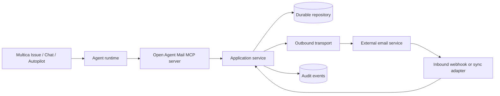

# Design: Multica agent-to-agent email

## Context

Multica coordinates discrete agent runs; it is not an email host or notification inbox for agents. Open Agent Mail currently has an in-memory `Store` and a browser-focused JSON API. Supporting external agent email requires durable storage, authenticated machine access, an MCP surface, and provider adapters without coupling Multica or SMTP semantics to the existing handler.

## Architecture



## Decisions

### Separate control, mailbox, and delivery planes

- Multica remains the control plane for task triggers and work records.
- Open Agent Mail owns identity, policy, normalized messages, claims, and audit.
- A provider adapter owns SMTP/IMAP or email API details.

This prevents email content from becoming an implicit Multica command channel.

### Add transport-neutral interfaces

Introduce `OutboundTransport.send(message)` and `InboundTransport.sync(cursor)` or provider webhook adapters. Provider responses normalize to accepted, queued, delivered, transient failure, permanent failure, or bounced.

The first adapter may target Cloudflare Email Service REST/webhooks or scoped SMTP/IMAP. Provider-specific IDs and raw diagnostic codes remain available in protected metadata.

### Run MCP beside the application service

Expose narrow MCP tools that call the same application service as HTTP handlers. Do not embed provider credentials in the MCP configuration. Each MCP credential resolves server-side to one agent identity and its allowed tools.

Conceptual tool set:

- `send_email`
- `list_messages`
- `get_message`
- `claim_message`
- `complete_message`
- `reply_email` (optional phase)

### Use durable state before accepting webhooks

The current in-memory store cannot safely return `202` for external ingestion. Add a repository interface and a transactional implementation before enabling inbound routing.

Core records:

- `agent_identity`: workspace, Multica agent, mailbox, sender, permissions, limits, status.
- `message`: internal ID, direction, normalized envelope/content, provider IDs, correlation, thread/hop metadata.
- `delivery_attempt`: attempt, idempotency key hash, provider result, retry schedule.
- `processing_claim`: message, agent, lease token, acquired/expires times.
- `processing_result`: terminal state, Multica run/Issue/comment IDs, outcome.
- `audit_event`: actor, action, decision, target IDs, error class, timestamp.

Unique constraints cover mailbox plus idempotency key, provider plus provider message ID, and one active claim per message.

### Authenticate inbound webhooks before parsing

Provider-native signatures are preferred. Otherwise use HMAC over timestamp plus raw body with constant-time comparison and a short replay window. Enforce Content-Length before reading, then verify signature, then parse. Store a hash and metadata for rejected events, not the untrusted body.

### Treat claims as leases

`claim_message` performs an atomic conditional update. It returns an opaque lease token required for completion. Expired leases can be reclaimed. Completion is terminal and idempotent.

### Correlate with structured metadata

Store workspace, project, Issue, and run IDs in the application record and provider-safe headers where supported. Subject tags remain human-readable routing hints, not authority or identity.

Recommended subject profile:

```text
[TYPE] [PROJECT] concise description
```

Initial types: `LOG-REPORT`, `WORK-REQUEST`, `RESULT`, `BLOCKED`, and `ACK`.

### Schedule polling outside agent runs

A Multica Autopilot starts a new receiver run at the desired interval. Provider retries and delayed work use a scheduler or queue. Agent runs never sleep until the next poll or retry.

### Enforce policy server-side

Default policy:

- Five outbound messages per mailbox per rolling hour.
- One recipient for work-handoff mail; 20 unique recipients per rolling day.
- 256 KiB normalized text.
- Recipient and sender-domain allowlists.
- Three automated hops per thread.
- No automatic reply to acknowledgement, bounce, bulk, or auto-submitted mail.

Prompts may be stricter but cannot relax server policy.

## Multica configuration

Use Multica's MCP config file or stdin mechanism rather than inline JSON when secrets are involved. Configuration shape depends on the selected coding CLI.

```json
{
  "mcpServers": {
    "open-agent-mail": {
      "command": "open-agent-mail-mcp",
      "args": ["--mailbox", "mbx_alpha"],
      "env": {
        "OPEN_AGENT_MAIL_API_URL": "https://mail.internal.example.com",
        "OPEN_AGENT_MAIL_TOKEN": "runtime-secret"
      }
    }
  }
}
```

Sender tokens receive send and read-own-sent permissions. Receiver tokens receive list, get, claim, complete, and policy-limited reply permissions.

## Operational flows

### Sender

1. Issue or Chat triggers Alpha.
2. Alpha analyzes project data and derives `issue:run:type` idempotency material.
3. MCP resolves Alpha's identity and applies policy.
4. Adapter sends and stores normalized provider status.
5. Alpha comments on the Issue with internal message ID and status.

### Scheduled receiver

1. Autopilot starts Beta every 30 minutes.
2. Beta lists unprocessed mail using exact sender, tag, and time filters.
3. Beta claims before reading or acting.
4. Beta treats content as untrusted input under the existing Issue authority.
5. Beta updates the Issue and completes the message with result IDs.

### Immediate receiver

1. Verified webhook stores and deduplicates a message.
2. An allowlisted rule validates recipient, workspace, type, and rate.
3. The rule creates/updates an Issue and assigns or mentions Beta.
4. Beta follows the normal claim and completion flow.

## Security

- Use scoped tokens or app passwords; primary human passwords are prohibited.
- Keep provider secrets in a secret manager or runtime environment.
- Redact credentials and bodies from logs and tool responses.
- Sanitize or omit HTML; attachment access is a separate future capability.
- Email instructions cannot expand repository, tool, recipient, deployment, or destructive-action scope.
- Provide mailbox, workspace, and transport kill switches.
- Publish SPF, DKIM, and DMARC for owned sender domains.

## Failure model

- Query idempotency state before retrying ambiguous sends.
- Retry transient failures with bounded exponential backoff and jitter through scheduled work.
- Never retry permanent recipient failures automatically.
- Reclaim processing only after lease expiry.
- Quarantine invalid signatures, cross-workspace correlation, and disallowed attachments.
- Surface delivery and processing failures on the linked Multica Issue.

## Observability

Audit identity, workspace, agent, tool, policy decision, message/provider IDs, correlation, claim, completion, and error class. Exclude routine bodies and secrets.

Metrics include accepted, delivered, bounced, throttled, signature failures, duplicates, claim conflicts, processing latency, loop rejections, and unprocessed backlog.

## Risks and mitigations

| Risk | Mitigation |
| --- | --- |
| Agent mail loop | Hop counter, reply suppression, server-enforced rate limits. |
| Duplicate work | Provider dedupe, idempotency keys, transactional claim leases. |
| Prompt injection | Treat email as untrusted data bounded by Multica task authority. |
| Credential exposure | Per-agent scoped tokens, secret injection, redacted logs. |
| Provider lock-in | Transport interfaces and normalized statuses. |
| Inbox drives unauthorized work | Verified correlation and allowlisted Issue-trigger automation. |
| Lost state | Durable transactional repository before external activation. |

## Rollout

Start with two staging agents, one allowlisted sender/recipient pair, and human approval for delivery. Validate failure and abuse scenarios before enabling scheduled or webhook-triggered runs. Rollback disables Autopilot, mailbox identities, provider routes/tokens, and the transport kill switch without deleting audit records.

## References

- [Multica overview](https://multica.ai/docs)
- [Multica agents](https://multica.ai/docs/agents)
- [Create and configure a Multica agent](https://multica.ai/docs/agents-create)
- [How Multica works](https://multica.ai/docs/how-multica-works)
- [Cloudflare Email Service integration](../../../docs/cloudflare-email.md)
- [OpenSpec conventions](https://github.com/Fission-AI/OpenSpec/blob/main/openspec/specs/openspec-conventions/spec.md)
